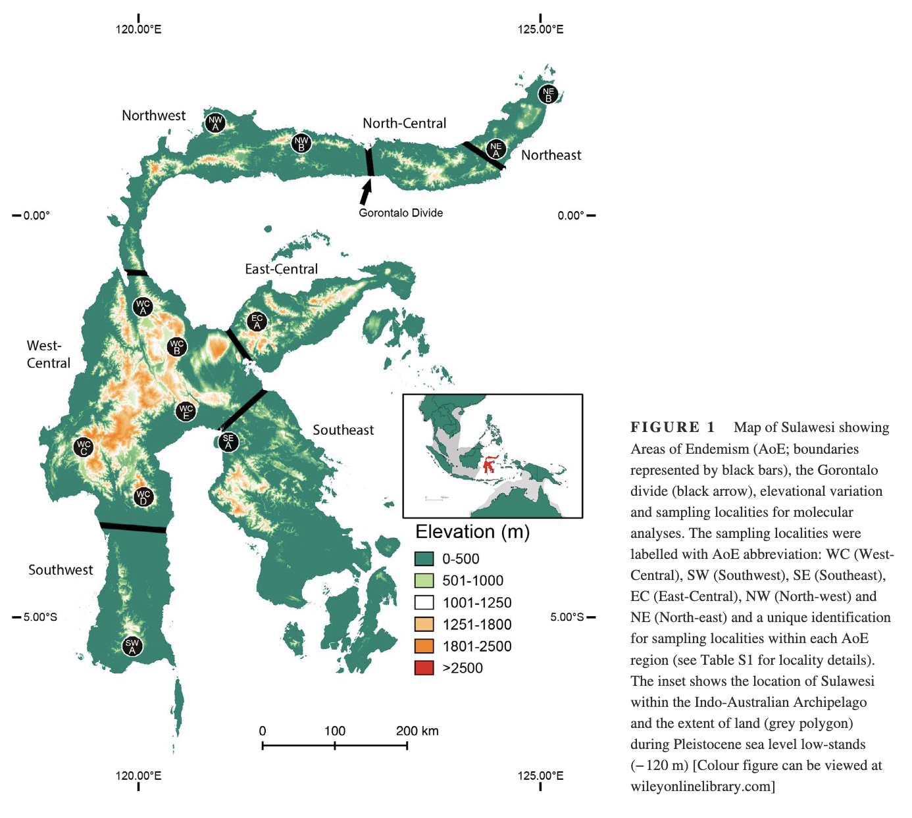
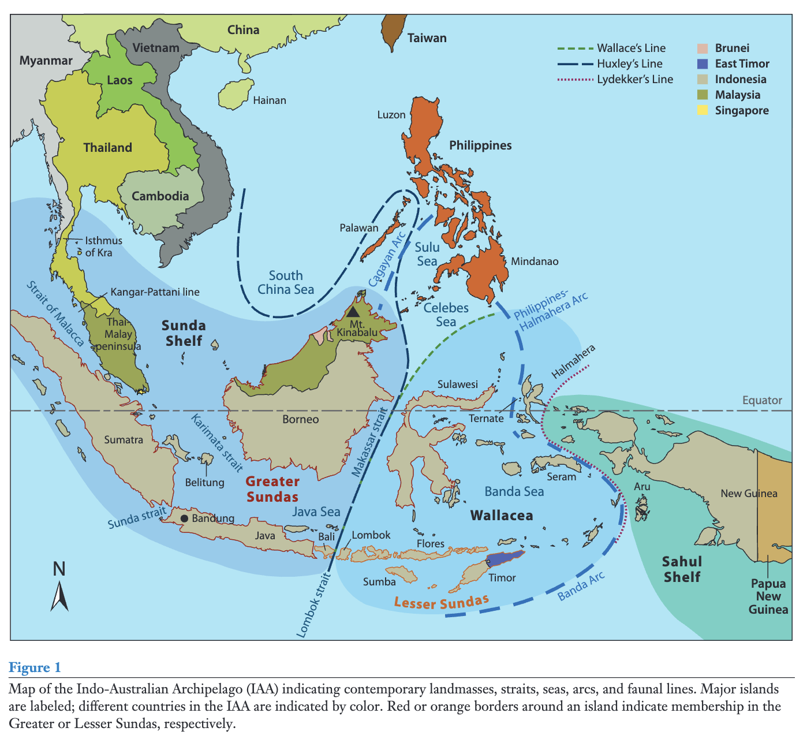

# Panduan Kurasi Data

| Versi             | 0.1.0                 |
| :---------------- | :-------------------- |
| Catatan perubahan | [Tautan](./CHANGELOG.md) |

## Pendahuluan

Panduan ini disusun untuk standardisasi format dan pengisian data dengan mempertimbangkan kemudahan pembacaan komputer dan pengisian data oleh manusia. Target awal untuk memiliki data taksonomi pada tingkat spesies. Namun, format ini disiapkan untuk bisa terus dikembangkan hingga ke level subspecies maupun lebih rendah lagi tingkat taksonominya. Basis data ini juga akan berkembang menjadi panduan lapangan setelah karakter spesies diisi dan dilengkapi dengan foto/ilustrasi/suara/video. Isian data spesies juga memungkinkan untuk mengakses informasi pihak ketiga, misalnya data DNA lewat “Taxon Explorer” NCBI GenBank, data keberadaan spesies di GBIF, dan sebagainya.

## Kontributor

Berikut daftar nama anggota Biodiv-INA yang berkontribusi dalam penulisan panduan ini:

* Heru Handika  
* Naufal Urfi Dhiya'ulhaq  
* Abid Famasya  
* Panji Gusti Akbar

## Kategori Data

Data dibagi menjadi tiga kategori: kelompok taksa, data taksa, dan media.

### **Data Kelompok Taksa**

Pengelompokan taksa tidak harus sesuai dengan kelompok kerja. Masing-masing kelompok kerja bisa membagi lagi datanya menjadi beberapa kelompok taksa (dibaca dataset). Setiap dataset memiliki metadata dan sistem penomoran sendiri. 

Maksimal total taksa per dataset perlu mempertimbangkan:

1. Kemudahan pembacaan dan pengisian data oleh manusia.  
2. Kapasitas distribusi. Semakin besar kelompok taksa semakin besar ukuran paket filenya. Data besar juga akan mempengaruhi waktu parsing oleh komputer.  
3. Jumlah taksa per kelompok taksa di Indonesia. Misalnya, untuk limit maksimal 1000 taksa, mamalia bisa dalam satu kelompok taksa, burung perlu dipecah minimal jadi dua kelompok, dst.  
   

Usulan maksimal 2000\. Isian bisa kurang, tetapi tidak boleh lebih.

### **Data Taksa**

Data ini berupa Google Sheets yang berisi daftar taksa dan informasi taksonominya. Penomoran dan metadata mengacu data kelompok taksa (dijelaskan dibawah).

### **Media**

Media tambahan yang bisa dipaketkan berbarengan dengan data taksa. Belum diprioritaskan untuk program tahap I. Media juga bisa menggunakan link eksternal selagi berada di domain publik. Lisensi medianya juga mengizinkan untuk digunakan oleh pihak ketiga.

## Sistem Penomoran

Penomoran kelompok taksa akan menggunakan Universally Unique Identifier (UUID) versi 7 ([https://en.wikipedia.org/wiki/Universally\_unique\_identifier](https://en.wikipedia.org/wiki/Universally_unique_identifier)). UUID memastikan keunikan identifikasi data dan memastikan data kita kompatibel dengan prinsip FAIR ([https://www.go-fair.org/fair-principles/](https://www.go-fair.org/fair-principles/)). UUID ini akan dicantumkan di file metadata. File metadata akan dihasilkan otomatis oleh program parsing yg sedang kita kembangkan.

**Usulan Penomoran Taksa**  
Untuk penomoran taksa, kita menggunakan sistem penomoran yang disepakati bersama. Nomornya berupa angka yang dapat digunakan untuk identifikasi.

Format penomoran:  
\<nomor-kelompok-grup+kelompok-kerja\>\<nomor-famili\>\<nomor-species\>

* Tiga digit pertama nomor grup dan kelompok kerja.  
* Dua Digit berikutnya nomor kelompok kerja  
* Tiga digit berikutnya nomor dataset. Dimulai dengan no 001 per masing-masing dataset. Ditentukan penomorannya oleh kelompok kerja.  
* 4 digit berikutnya urutan species. Dimulai dengan 0001 per masing-masing famili  
    
  **Nomor Grup Kelompok Kerja**

| No identifikasi | Grup |
| :---- | :---- |
| 1 | Mikroba |
| 2 | Plantae |
| 3 | Insecta |
| 4 | Vertebrata |
| 5 | Animalia lainnya |

  **Nomor identifikasi kelompok kerja**

| No Identifikasi | Kelompok Kerja | idKK |
| :---- | :---- | :---- |
| **KK Mikroba** |  |  |
| 01 | Virus dan prokaryotes | 101 |
| 02 | Fungi | 102 |
| 03 | Algae | 103 |
| **KK Plantae** |  |  |
| 01 | Lumut | 201 |
| 02 | Pteridophytes | 202 |
| 03 | Spermatophyta | 203 |
| **KK Insecta** |  |  |
| 01 | Lepidoptera | 301 |
| 02 | Odonata | 302 |
| 03 | Coleoptera | 303 |
| 04 | Mantodea | 304 |
| 05 | Phasmida | 305 |
| 06 | Hemiptera | 306 |
| 07 | Hymenoptera | 307 |
| 08 | Orthoptera | 308 |
| **KK Vertebrata** |  |  |
| 01 | Pisces | 401 |
| 02 | Amphibia | 402 |
| 03 | Reptilia | 403 |
| 04 | Aves | 404 |
| 05 | Mammalia | 405 |
| **KK Animalia Lainnya** |  |  |
| 01 | Cnidaria | 501 |
| 02 | Porifera | 502 |
| 03 | Echinodermata | 503 |
| 04 | Platyhelminthes | 504 |
| 05 | Mollusca | 505 |
| 06 | Annelida | 506 |
| 07 | Arachnida | 507 |
| 08 | Crustacea | 508 |
| 09 | Myriapoda | 509 |
| 10 | Nematoda | 510 |

## Pengisian Data Taksonomi

### **Pemakaian Bahasa**

* Nama famili, genus, dan spesies memakai nama latin sesuai standar taksonomi yang disetujui KK Kelompok Taksa dan diberitahukan ke Komite Inti.  
* Nama umum (common names) utama dalam Bahasa Inggris dan Bahasa Indonesia sesuai kesepakatan KK kelompok taksa jika belum ada standardisasi.    
* Bahasa Inggris menggunakan menggunakan Bahasa Inggris Amerika Serikat. Alasannya, untuk konsistensi dengan Bahasa Inggris komputer dan bahasa pemrograman. Bahasa Inggris Amerika Serikat juga merupakan Bahasa Inggris yang paling banyak dipakai di Indonesia. 

### **Format pengisian data**

* Nama file dan folder menggunakan snake\_case. Format awal cukup dengan format Google Sheets. Saat dirilis, dieksport menjadi CSV. Contoh penamaan file: mamalia\_indonesia.csv. Jika ada pembagian dataset, penamaan file menjadi \<kelompok-data\>\_\<KK\>\_indonesia.csv.   
* Nama kolom menggunakan lowercase untuk yang satu kata dan camelCase untuk yang lebih dari satu kata. Contohnya: id dan taxonRank  
* Untuk kolom yang isiannya dalam berbagai bahasa. Kolom dipisah dengan masing-masingnya diberi suffix underscore dan kode bahasa sesuai **ISO 639-1** ([https://www.loc.gov/standards/iso639-2/php/code\_list.php](https://www.loc.gov/standards/iso639-2/php/code_list.php)). Contohnya untuk nama umum dalam bahasa Inggris mainCommonName\_EN dan versi bahasa Indonesia nya mainCommonName\_ID.  
* Sebagian bahasa, seperti Bahasa Inggris, memiliki berbagai versi negara penutur bahasa tersebut. Kolom yang berisi data dengan bahasa spesifik negara tertentu, penamaan kolom menggunakan kode bahasa dan negara: mainCommonName\_EN-US.   
* Daftar (*list*) dipisah menggunakan titik koma  “;” mengacu GBIF. Contohnya: Indonesia;Malaysia;Brunei.  
* Jika didalam daftarnya terdapat subdaftar (*sublist*). Subdaftar dipisah menggunakan tanda pipe berspasi “ | ”. Contohnya: stateProvince:Sumatra Barat | Jambi | Riau;city:Padang | Pekanbaru | Bukittinggi  
* Gunakan tanda pagar untuk pemisah identifikasi kata dalam subdaftar. Contohnya pada isian symbions: hasParasite:biodivina\#100011 | biodivina\#100012;eatenBy:biodivina\#10001 | biodivina\#10001.

### **Kolom dan terminologi data taksonomi**

Penjelasan lebih lengkap mengenai pengisian kolom terdapat di bawah tabel.

**Catatan:** 

* Kolom dengan label berwarna kuning bisa diisi jika memungkinkan, tetapi belum menjadi prioritas untuk program Biodiv-INA Tahap I.   
* Tipe data SQL sesuai format database SQLite untuk aplikasi selain website. Untuk website, akan menyesuaikan dengan format Postgres jika dibutuhkan.   
* Contoh penggunaan secara umum. Diharapkan masing-masing KK kelompok taksa memiliki contoh penggunaan untuk kelompok taksa yang menjadi tanggung jawab KK tersebut.  
* Tipe data akan dilengkapi dengan bahasa pemrograman lain untuk memudahkan penulisan aplikasi pendamping.

| Nama Kolom | Deskripsi | Format pengisian | Contoh penggunaan | Terminologi Darwin Core | Tipe data Rust | Tipe data SQL |
| :---- | :---- | :---- | :---- | :---- | :---- | :---- |
| kkID | Nomor kelompok kerja . Kolom hanya untuk memudahkan pengurutan nomor identifikasi. | \<satu-digit-no-group-dan-dua-digit-no-kk\> | 405 |  |  |  |
| datasetID | Nomor dataset. Kolom hanya untuk memudahkan pengurutan nomor identifikasi. | \<nomor-identifikasi\> | 001 |  |  |  |
| speciesID | Nomor spesies. Kolom hanya untuk memudahkan pengurutan nomor identifikasi. | \<nomor-identifikasi\> | 0001 |  |  |  |
| id | Tidak diisi manual. Gunakan formula untuk menggabungkan semua nomor identifikasi. | \=CONCATENATE($A$2,TEXT(B2,"000"),TEXT(C2,"0000")) | 4050010001 |  |  |  |
| taxonRank | Level taksonomi. Opsi selalu *species* untuk program tahap  I. Bisa dikembangkan jadi *subspecies* kedepannya. Penting diingat kata kuncinya dalam Bahasa Inggris. | \<kata-kunci-tingkatan-taksa\> | species |  |  |  |
| kingdom | Nama kingdom. Format sentence case | \<nama-kingdom\> | Animalia |  | String | TEXT |
| phylum | Nama filum | \<nama-filum\> | Chordata |  | String | TEXT |
| phyloGroup | Grup taksa dibawah phylum dan di atas ordo. Disesuaikan dengan filogeni masing-masing kelompok taksa. Digunakan dalam penyusunan taksa untuk visualisasi database. | \<nama-group\> | Placentalia |  |  |  |
| phyloGroupSort | Urutan grup berdasarkan pohon filogeni. | \<nomor-urut-filogenetika\> | 3 |  | usize | INTEGER |
| taxonClass | Nama kelas. Awalan taxon untuk menghindari konflik dengan kata kunci bahasa pemograman. Ditulis nama Bahasa Inggris. | \<nama-kelas\> | Mammalia |  |  |  |
| taxonOrder | Nama ordo. Awalan taxon untuk menghindari konflik dengan kata kunci bahasa pemograman. Divisualisasi menjadi order (EN) atau ordo (ID) setalah parsing.  | \<nama-ordo\> | Rodentia |  | String | TEXT |
| taxonFamily | Nama famili. Parsing seperti dengan taxonOrder. | \<nama-famili\> | Muridae |  | String | TEXT |
| genus | Name genus dengan format huruf regular (tidak ditulis miring). | \<nama-genus\> | Bunomys |  | String | TEXT |
| species | Nama species, termasuk genus dan epithet (nama penjelas): Rattus rattus. Ditulis dengan huruf biasa. | \<nama-genus\>\<spasi\>\<nama-penjelas\> | Bunomys coelestis |  | String | TEXT |
| scientificNameAuthorship | Informasi authorship lengkap dengan nama penulis dan tahunnya. Tulis sesuai konvensi internasional penamaan spesies, seperti ICZN, ICBN, dan ICNafp. Penjelasan lebih lengkap dibawah tabel. | \<nama-belakang-author\> | Thomas |  | String | TEXT |
| taxonomicRemarks\_EN-US | Catatan taksonomi (jika ada). Misalnya, studi menunjukkan spesies ini kemungkinan mengacu pada beberapa spesies atau sinomim dari spesies lain, namun status taksonominya masih ditetapkan dipisah. Bisa juga diisi dengan informasi mengenai catatan perubahan taksonomi. | \<catatan-dalam-bahasa-inggris\> |  |  |  |  |
| taxonomicRemarks\_ID | Sama taxonomicRemarks\_EN-US. Ditulis dalam Bahasa Indonesia. |  |  |  |  |  |
| recognitionBasedOn | Basis pendeskripsian species. Diisi dengan daftar opsi. Opsi: morphology, sangerDNA, genomicDNA, ecology. | \<kata-kunci-1\>\<titik koma\>\<kata-kunci-2\> | morphology;sangerDNA;genomicDNA |  |  |  |
| mainCommonName\_EN | Nama utama dalam Bahasa Inggris. Pilih dari opsi yang ada jika belum ditetapkan   | \<nama-utama\> | Lompobatang Hill Rat |  | String | TEXT |
| otherCommonName\_EN | Nama lainnya dalam Bahasa Inggris | \<nama-lainnya-1\>\<semi-colon\>\<nama-lainnya-2\>\<semi-colon\>\<dst\> | Heavenly Hill Rat;Lompobatang Bunomys |  | String | TEXT |
| commonNameRemarks\_EN | Catatan mengenai nama umum dalam Bahasa Inggris. | \<catatan-dalam-bahasa-inggris\> |  |  |  |  |
| mainCommonName\_ID | Nama utama dalam Bahasa Indonesia. Pilih jika belum ditetapkan. Penulisan sesuai format KBBI. | \<nama-utama\> | Pangusan Lompobatang |  | String | TEXT |
| otherCommonName\_ID | Nama lainnya, termasuk nama daerah. Kosongkan jika tidak ada / tidak diketahui. Penulisan sesuai format Ejaan Bahasa Indonesia. | \<bahasa-1\>\<titik dua\>\<nama-1\>\<titik koma\<bahasa-2\>\<titik dua\>\<nama-2\> | minangkabau:mancik |  | String | TEXT |
| commonNameRemarks\_ID | Catatan mengenai nama umum dalam Bahasa Indonesia. Tambahkan referensi jika ada. | \<catatan-dalam-bahasa-indonesia\>\<refrensi\>\<\[nomor-referensi\]\> | Nama Bahasa Indonesia sesuai Maryanto et al. 2019 \[1\] |  | String | TEXT |
| typeVoucher | Nomor koleksi spesimen tipe. Diwajibkan untuk holotype/neotype. Pengisian data bisa dilengkapi dengan nomor koleksi jika ada. ID institusi sesuai keterengan dibawah tabel ini. | \<type\>\<titik dua\>\<\[ID institusi\]\>\<nomor-koleksi\> | holotype:\[BMNH\]Mamm:1897.1.3.12;paratype:\[BMNH\];\[MZB\] |  | String | TEXT |
| verbatimTypeLocality | Lokasi penemuan spesimen tipe sesuaieda den publikasi deskripsi spesies (jika berbgan nama saat ini). Jika sama, masukkan data di typeLocality. Tambahkan ketinggian jika tidak dalam meter. | \<type\>\<titik dua\>\<nama-lokasi-sesuai publikasi\>\<titik koma\>\<tipe lainnya\>\<nama-lokasi-sesuai publikasi\> | holotype:Bonthain Peak, 6000 ft, south-western Sulawesi, Indonesia;paratype: |  | String | TEXT |
| typeLocality | Lokasi penemuan spesimen tipe sesuai nama lokasi sekarang. Gunakan penamaan sesuai negara asal spesimen tanpa penunjuk administrasi. Untuk program ini dalam Bahasa Indonesia. Misalnya, tulis Sulawesi Selatan, bukan Provinsi Sulawesi Selatan atau South Sulawesi. | \<type\>\<titik dua\>\<nama-lokasi\>\<titik koma\>\<tipe lainnya\>\<nama-lokasi\> | holotype:Gunung Lompobatang, Sulawesi Selatan, Indonesia. |  |  |  |
| typeLocalityLatitude | Koordinat latitudinal spesimen tipe. Isi apa adanya sesuai publikasi. Visualisasi di parsing jadi dua jika koordinat tidak desimal: verbatim (sesuai publikasi) dan desimal (hasil konversi). Kosongkan jika tidak diketahui. | \<type\>\<titik dua\>\<koordinat\>\<titik koma\>\<tipe lainnya\>\<koordinat\> |  |  | f32 | REAL |
| typeLocalityLongitude | Koordinat longitudinal. Diparsing seperti typeLocalityLatitude. Kosongkan jika tidak diketahui. | \<type\>\<titik dua\>\<koordinat\>\<titik koma\>\<tipe lainnya\>\<koordinat\> |  |  | f32 | REAL |
| typeLocalityElevationInMeters | Ketinggian lokasi penemuan dalam meter. Ditulis angka saja tanpa unitnya. Untuk biota daratan. Kosongkan jika tidak ada.  | \<type\>\<titik dua\>\<ketinggian-lokasi-dalam-meter\>\<titik koma\>\<tipe lainnya\>\<ketinggian-lokasi-dalam-meter\> | holotype:1830;paratype:1900 |  | usize | INTEGER |
| typeLocalityDepthInMeters | Kedalaman lokasi penemuan spesimen tipe dalam meter. Untuk biota akuatik. Kosongkan jika tidak ada. | \<type\>\<titik dua\>\<kedalaman-lokasi-dalam-meter\> |  |  |  |  |
| originalNameAsDescribed | Nama sesuai deskripsi pertama.  | \<genus\>\<spasi\>\<spesies\> | Mus coelestis |  |  |  |
| synonymsWithAuthorYears | Daftar synonyms. Lengkap dengan author, tahunnya, dan referensi artikel ilmiah. Kosongkan jika tidak ada. | \<genus\>\<spasi\>\<species\>\<spasi\<penulis\>\<spasi\>\<tahun\> |  |  | String | TEXT |
| countryDistribution | Negara distribusi species. Jika distribusi native, gunakan titik koma sebagai tanda pemisah jika terdistribusi di beberapa negara. Gunakan kata kunci distributionStatus jika terdapat distribusi non-native. | \<nama-negara-1\>\<titik koma\>\<nama-negara-2\> | Indonesia;Malaysia |  | String | TEXT |
| biogeographicRegion | Distribusi berdasarkan ekoregion. Opsi mengacu ke keterangan kata kunci dibawah tabel ini. | \<kode-ekoregion\>\<titik dua\>\<nama-ekoregion\> | aOE:South West Sulawesi |  | String | TEXT |
| distributionStatus | Status distribusi spesies. Opsi mengacu kata kunci di keterangan di kata kunci setelah tabel ini. | \<kode-status-distribusi\> | NV |  | Enum | TEXT |
| nativeLocalDistribution\_ID | Distribusi asli berdasarkan batas administratif. Berguna untuk pengambil kebijakan konservasi. Level administrasi disesuaikan dengan tingkatkan wilayah Indonesia. | \<level-administrasi\>\<titik dua\>\<distribusi-1\>\<tanda | \>\<distribusi-2\>\<titik koma\> \<level-administrasi-2\>\<titik dua\>\<distribusi-1\>\<tanda | \>\<distribusi-2\> | kabupaten:Bantaeng;kecamatan:Parigi | Sinjai Barat | Kindang | Rumbia |  | Vector\<String\> | TEXT |
| introducedLocalDistribution\_ID | Distribusi introduksi berdasarkan batas administratif. Opsi sama dengan nativeLocalDistribution\_ID. Kosongkan jika bukan spesies introduksi. | \<level-administrasi\>\<titik dua\>\<distribusi-1\>\<tanda | \>\<distribusi-2\>\<titik koma\>\<level-administrasi-2\>\<titik dua\>\<distribusi-1\>\<tanda | \>\<distribusi-2\> |  |  | Vector\<String\> | TEXT |
| distributionRemarks\_EN-US | Catatan distribusi dalam American English. Referensi tulis dalam brackets (tanda kurung besar). Contohnya \[1\]. Sesuaikan dengan list di referenceNameLinks | \<catatan-distribusi\> | The species is known only from a single mountain range, Lompobatang-Bawakareng, in the southwestern peninsula of Sulawesi.\[1\]  |  | String | TEXT |
| distributionRemarks\_ID | Catatan distribusi dalam Bahasa Indonesia. Penulisan referensi seperti distributionRemarks\_EN-US. | \<catatan-distribusi\> | Spesies ini hanya diketahui terdistribusi di pegunungan Lompobatang-Bawakaraeng di bagian semenanjung barat daya pulau Sulawesi. |  | String | TEXT |
| keyMeasurements | Data ukuran karakter utama. Diisi jika ada. Ditulis sesuai standar konvensi taksa terkait. Jika menggunakan singkatan, gunakan standar internasional lengkap dengan unit pengukurannya dalam standard metrik. | \<karakter\>\<titik dua\>\<ukuran\>\<unit\>\<titik koma\>\<karakter-2\>\<titik dua\>\<ukuran\>\<unit\> | HB:80-90 mm;TL:80-100mm;HF:13-15mm;ER:12-16mm;WT:70-80g  |  | String | TEXT |
| keyCharacters\_EN-US | Karakter utama spesies untuk membedakan dengan spesies berdekatan. | \<catatan-karakter-utama\> | Medium size rats (\~100g). The tail is short or the same length as the head and body. |  | String | TEXT |
| keyCharacters\_ID | Karakter utama dalam Bahasa Indonesia | \<catatan-karakter-utama\> | Tikus berukuran sedang (\~100g). Ekor lebih pendek dari kepala-badan atau sama panjang dengan kepala-badan. |  |  |  |
| characterRemarks\_EN-US | Catatan tambahan mengenai karakter taksa. | \<catatan-tambahan\> | Other recognized species of Bunomys have bigger body size. |  | String | TEXT |
| characterRemarks\_ID | Catatan tambahan dalam Bahasa Indonesia | \<catatan-tambahan\> | Spesies Bunomys lainnya umumnya  |  |  |  |
| habitatRemarks\_EN-US | Catatan mengenai habitat distribusi taksa. | \<catatan-habitat\> | Typically found in the mountain forest of Lompobatang-Bawakaraeng. |  | String | TEXT |
| habitatRemarks\_ID | Catatan mengenai habitat dalam Bahasa Indonesia | \<catatan-habitat\> | Umumnya ditemukan di hutan pegunungan di kawasan Lompobatang-Bawakaraeng. |  |  |  |
| additionalRemarks\_EN-US | Catatan tambahan dalam Bahasa Inggris. Bisa diisi dengan informasi taksonomi terbaru, kekerabatan filegenetika, dan lain-lain. Lengkapi dengan referensi artikel ilmiah. Kosongkan jika tidak ada catatan tambahan. | \<catatan-tambahan\> |  |  |  |  |
| additionalRemarks\_ID | Catatan tambahan dalam Bahasa Indonesia. Diisi seperti additionalRemarks\_EN-US. | \<catatan-tambahan\> |  |  |  |  |
| iucnStatus | Kategori IUCN Red List diisi dalam format dua huruf standar IUCN. Opsi: EX, EW, CR, EN, VU, NT, LC, DD, NE.  | \<kategori-iucn\> | EN |  | Enum | TEXT |
| citesStatus | Status apendik CITES. Opsi: 1, 2, 3\. Kosongkan jika tidak dievaluasi. | \<kategori-cites\> |  |  | Enum | INTEGER |
| countryStatus | Status konservasi di negara asal takson lengkap dengan translasi dalam Bahasa Inggris. | \<nama-negara\>\<titik dua\>\<status\>\<spasi\>\<buka kurung\>\<translasi Bahasa Inggris\>\<tutup kurung\> | Indonesia:Tidak dilindungi (unprotected);Malaysia: |  | String | TEXT |
| countryStatusReference | Referensi undang-undang mengenai status takson. | \<nama-negara\>\<titik dua\>\<undang-undang\> |  |  |  |  |
| symbionts | Interaksi spesies dengan spesies lainnya. Data ini akan ditautkan dengan informasi taksa simbiotik-nya. Opsi: hasParasite, hostOf, preyedUponBy, eatenBy, eats. Kosongkan jika tidak diketahui. | \<kode-interaksi\>\<titik dua\>\<provider\>\<tanda pagar\>\<nomor-identifikasi\> | hasParasite:biodivina\#40100011 | biodivina\#100012;eatenBy:biodivina\#10001 | biodivina\#10001 |  | String | TEXT |
| symbiontRemarks\_EN-US | Catatan interaksi dalam Bahasa Inggris. Lengkapi dengan referensi artikel ilmiah. Kosongkan jika tidak ada. | \<catatan interaksi\> | Parasite interaction was first described by Winterhoff et al. \[2\]. |  |  |  |
| symbiontRemarks\_ID | Catatan interaksi dalam Bahasa Indonesia. Diisi sesuai symbionRemarks\_EN-US. | \<catatan interaksi\> | Interaksi parasit pertama kali dideskripsikan oleh Winterhoff et al. \[2\] |  |  |  |
| referenceURIs | Referensi taksa. List berdasarkan urutan penggunaan. Penulisan nomor urutan dan link referensi. Utamakan berupa DOI. Jika tidak ada, gunakan tautan asli. | \<\[urutan\]\>\<spasi\>\<link\> | \[1\] [https://doi.org/10.1645/19-136](https://doi.org/10.1645/19-136) \[2\]  |  | String | TEXT |
| externalTaxonIdentifiers | Nomor identitas data taksonomi eksternal. Hanya untuk database yang dikenali. Lihat dibawah untuk opsinya. Diluar opsi ini gunakan externalURIs. | \<provider-1\>\<titik dua\>\<identifier-1\>\<titik koma\>\<provider-2\>\<titik dua\>\<identifier-2\> | mdd:1003513; ncbi:txid2606483 |  | Vector\<String\> | TEXT |
| externalURIs | Tautan lainnya yang tidak termasuk identitas taksonomi maupun referensi. Disediakan untuk link yang tidak memiliki takson identifier dan tautan permanen. | \<link-1\>\<titik koma\>\<link-2\> | https://www.iucnredlist.org/species/3329/22451992; |  | Vector\<String\> | TEXT |
| associatedData | Tipe data dan nomor identifikasi menggunakan sumber sendiri. File-nya satu paket dengan data taksa. Opsi: video, audio, photo, illustration, geoJSON. Kosongkan jika tidak ada. | \<tipe-data\>\<titik dua\>\<nomor-identifikasi\> |  |  | String | TEXT |
| externalAssociatedDataURIs | Data dari sumber eksternal. Pastikan kesepakatan copyright sebelum menggunakan. Opsi seperti associatedData | \<tipe-data-1\>\<titik dua\>\<copyright-1\> | \<links-1\>;\<tipe-data-1\>\<titik dua\>\<copyright-2\> | \<links-2\> | photo: |  | String | TEXT |
| contributorNameOrcid | Daftar nama kontributor dan ORCID-nya. | \<nama-kontributor-1\>\<titik dua\>\<ORCID-1\>\<titik koma\>\<nama-kontributor-2\>\<titik dua\>\<ORCID-2\> | Heru Handika:0000-0002-2834-7175 |  | String | TEXT |

## Penjelasan Pengisian Data Taksa dan Daftar Kata Kunci

### **scientificNameAuthorship**

Informasi kepenulisan nama sainstifik. Diisi sesuai dengan konvensi internasional penamaan spesies, seperti ICZN, ICBN, dan ICNafp. Tulis apa adanya lengkap dengan tahun, menggunakan atau tanpa tanda kurung. Misalnya:

1. Jebb and Cheek (1997)  
2. (Thomas, 1896\)  
3. Esselstyn, Achmadi, Handika, & Rowe, 2015  
4. Iskandar & Mumpuni, 2014

### **Common Name**

Berlaku untuk **mainCommonName\_EN**, **otherCommonName\_EN**, **commonNameRemarks\_EN**, **mainCommonName\_ID**, **otherCommonName\_ID**, **commonNameRemarks\_ID.**

Program ini juga menjadi tujuan untuk standardisasi nama umum. Kurasi data diharapkan dapat dilengkapi dengan nama umum yang terstandardisasi sesuai kesepakatan bersama di KK masing-masing. 

Aturan pengisian nama umum:

1. Nama English merujuk ke publikasi deskripsi spesies atau sumber terpercaya.  
2. Penulisan nama Indonesia merujuk ke Pedoman Umum Ejaan Bahasa Indonesia ([PUEBI.pdf (kemdikbud.go.id)](https://badanbahasa.kemdikbud.go.id/lamanbahasa/sites/default/files/PUEBI.pdf).  
3. Jika tidak ada rekomendasi dari penulis maupun sumber terpercaya, KK bisa menentukan nama.  
4. Jika ada beberapa nama yang tersedia dan nama utama belum ditentukan, KK menentukan nama utama sesuai kesepakatan bersama.  
5. Jika tidak terdapat rekomendasi nama dari publikasi deskripsi spesies dan nama yang digunakan oleh sumber terpercaya maknanya kurang sesuai dengan pemahaman kearifan lokal, KK bisa menentukan nama sesuai kesepakatan bersama.  
6. **commonNameRemarks\_EN** dan **commonNameRemarks\_ID.** bisa digunakan untuk memberikan keterangan mengenai dasar pemilihan nama utama maupun jika ada catatan lain mengenai **otherCommonName.** Tambahkan referensi di catatan jika tersedia. 

Beberapa dasar yang bisa digunakan dalam pemberian nama umum jika nama tidak tersedia:

1. Mengacu ke nama umum spesies terdekat atau kelompoknya ditambahkan dengan pengertian nama penunjuk spesiesnya.  
2. Memakai nama lokal dan ditranslasi ke Bahasa Inggris untuk nama English nya.  
3. Dalam mentranslasi Bahasa Indonesia ke Bahasa Inggris, *proper noun* atau kata benda yang merujuk ke sesuatu yang spesifik tidak ditranslasi. Beberapa contoh proper noun: nama tempat, nama peristiwa, dan nama orang. Misalnya, Bukittinggi tidak ditranslasi menjadi Highhill, Gunung Gede menjadi Large Mountain.  
4. Jika memungkinkan, hindari penggunaan nama hasil turunan penamaan zaman kolonialisme. Misalnya, menggunakan nama Maluku, bukan Moluccas.

### **countryDistribution**

Aturan pengisian data country distribution:

1. Jika semua daftar negara merupakan wilayah distribusi asli, daftar nama dipisah dengan titik koma. Misalnya: Indonesia;Malaysia;Brunei.  
2. Jika terdapat perbedaan status distribusi, gunakan kata kunci distributionStatus. Misalnya: NV:Indonesia;IN:Malaysia | Brunei.

### **distributionStatus**

Kata kunci yang digunakan untuk mengisi data status distribusi. Kita menggunakan NV untuk native untuk menghindari kerancuan dengan NA (not applicable). 

| Kata kunci | Kepanjangan | Keterangan |
| :---- | :---- | :---- |
| NV | Native | Distribusi asli |
| PN | Partially native | Distribusi asli pada sebagian wilayah Indonesia dan introduksi pada sebagian yang lain. |
| IN | Introduced | Sepenuhnya merupakan spesies introduksi. |
| EX | Extinct | Punah sepenuhnya. |
| UNK | Unknown | Status distribusi tidak diketahui. |

### **Specimen Type**

Digunakan untuk kolom type: **typeVoucher** dan **verbatimTypeLocality.**

| Kata kunci | Keterangan |
| :---- | :---- |
| holotype | Spesimen tunggal yang ditetapkan sebagai rujukan dalam deskripsi asli suatu spesies. |
| paratype | Spesimen lain yang dicantum dalam deskripsi suatu spesies sebagai pendamping spesimen holotipe. Bisa satu atau lebih dari satu individu. |
| allotype | Spesimen tipe rujukan yang memiliki kelamin berbeda dengan holotipe. Diambil dari paratipe. Kadang juga digunakan sebagai spesimen acuan yang karakternya tidak terdapat di spesimen tipe. |
| neotype | Spesimen tunggal yang ditetapkan belakangan sebagai rujukan dalam deskripsi suatu spesies. Biasanya karena deskripsi asli tidak memiliki holotipe, holotipe hilang, atau rusak. |
| syntype | Semua spesimen yang dijadikan rujukan dalam deskripsi suatu spesies. Semua kedudukan spesimen ini sama karena tidak ada penyebutan holotipe dalam deskripsi spesies tersebut. |
| lectotype | Spesimen tunggal yang dipilih belakangan dari daftar spesimen tipe untuk dijadikan spesimen acuan. Kedudukannya menjadi seperti holotipe. |
| paralectotype | Spesimen lainnya yang dipilih belakangan dari daftar spesimen tipe. Kedudukannya mirip seperti paratipe. |
| isotype | Biasanya dipakai di botani. Merujuk kepada duplikat dari spesimen holotipe. |
| UNK | Unknown. Tipe tidak diketahui. |

### **typeVoucher**

Standarisasi kode institusi untuk typeVoucher. Kode institusi dalam tanda kurung siku “\[\]”. Contohnya, \[MZB\]. Aturan pengisian typeVoucher:

1. Nomor koleksi diutamakan untuk holotype, neotype, lectotype, atau spesimen tipe lainnya yang jumlahnya tidak melebihi dari 5 spesimens.  
2. Untuk spesimen yang lebih dari 5 spesimen, sering untuk paratype, cukup diisi kode institusi tempat penyimpanan spesimen.

| Kode | Nama Institut | Kota | Negara | Keterangan/Sinonim |
| :---- | :---- | :---- | :---- | :---- |
| ACUNHC | Abilene Christian University Natural History Collection | Abilene | USA | NA |
| AM | Australian Museum | Sydney | Australia | NA |
| AMNH | American Museum of Natural History | New York | USA | NA |
| ANSP | Academy of Natural Sciences of Drexel University | Philadelphia | USA | NA |
| ANWC | Australian National Wildlife Collection | Canberra | Australia | NA |
| BM | Natural History Museum, London | London | United Kingdom | British Museum (Natural History) |
| BPBM | Bernice Pauahi Bishop Museum | Honolulu | USA | NA |
| BRTC | Biodiversity Research and Teaching Collections Texas A\&M University | College Station | USA | NA |
| CAS | California Academy of Sciences | San Francisco | USA | NA |
| CBF | Coleccíon Boliviana de Fauna | La Paz | Bolivia | NA |
| CEBIOMAS | Centro de Ecología y Biodiversidad, Lima, Peru | Lima | Peru | NA |
| CIB | Centro de Investigaciones Biológicas del Noroeste | La Paz | Mexico | NA |
| CM | Carnegie Museum of Natural History | Pittsburgh | USA | NA |
| CML | Colección Mamíferos Lillo | Tucumán | Argentina | NA |
| CMUFLA | Coleção de Mamíferos da Universidade Federal de Lavras | Lavras | Brazil | NA |
| CTNRC | Centre for Thai National Reference Collections | Bangkok | Thailand | NA |
| CTUA | Colección Teriológica de la Universidad de Antioquia, Medellín | Medellín | Colombia | Museo de la Universidad de Antioquia (MUA) |
| CUMV | Cornell University Museum of Vertebrates | Ithaca | USA | NA |
| CVULA | Colección de Vertebrados de la Universidad de los Andes | Bogotá | Colombia | NA |
| CZL | Centro de Zoologica, Instituto de Investigação Científica Tropical | Lisbon | Portugal | NA |
| DM | Durban Natural Science Museum | Durban | South Africa | NA |
| DZAB | Department of Zoology and Biological Anthropology of the University of Sassari | Sassari | Italy | NA |
| DZSJRP | Universidade Estadual Paulista “Júlio de Mesquita Filho" | São José do Rio Preto | Brazil | NA |
| DZUP | Departamento de Zoologia, Setor de Ciências Biológicas, Universidade Federal do Paraná | Curitiba | Brazil | NA |
| EBD | Estación Biológica de Doñana | Seville | Spain | NA |
| EBRG | Museo de la Estación Biológica de Rancho Grande | Aragua | Venezuela | NA |
| ENCB | Escuela Nacional de Ciencias Biológicas | Mexico City | Mexico | Colección de Mamíferos, Escuela Nacional de Ciencias Biológicas, Instituto Politécnico Nacional |
| EOWBLC | E. O. Wilson Biodiversity Laboratory Collection at Gorongosa National Park | Chitengo | Mozambique | NA |
| FMNH | Field Museum of Natural History | Chicago | USA | NA |
| GEC | Grupo de Exploraciones Científicas | Havana | Cuba | NA |
| GZHU | Key Laboratory of Conservation and Application in Biodiversity of South China, School of Life Sciences, Guangzhou University | Guangzhou | China | NA |
| GZNU | Guizhou Normal University | Guizhou | China | NA |
| HNHM | Hungarian Natural History Museum | Budapest | Hungary | NA |
| HZM | Harrison Zoological Institute | Kent | United Kingdom | NA |
| IADIZA | Instituto Argentino de Investigaciones de las Zonas Aridas | Mendoza | Argentina | NA |
| IBUNAM | Colección de Mamíferos, Instituto de Biología, Universidad Nacional Autónoma de México | Mexico City | Mexico | NA |
| IBSS | Institute of Biology and Soil Science, Far East Branch of the Russian Academy of Sciences | Vladivostok | Russia | NA |
| ICN | Colección de Mamíferos Alberto Cadena García, Instituto de Ciencias Naturales, Bogotá | Bogotá | Colombia | NA |
| IEBR | Institute of Ecology and Biological Resources | Hanoi | Vietnam | NA |
| INPA | National Research Institute of the Amazon | Manaus | Brazil | NA |
| IOZCAS | Institute of Zoology, Chinese Academy of Sciences | Beijing | China | NA |
| KIZ | Kunming Institute of Zoology | Kunming | China | NA |
| KU | University of Kansas Biodiversity Institute and Natural History Museum | Lawrence | USA | NA |
| KUZ | Kyoto University Museum | Kyoto | Japan | NA |
| LACM | Natural History Museum of Los Angeles County | Los Angeles | USA | NA |
| LKCNHM | Lee Kong Chian Natural History Museum | Singapore | Singapore | NA |
| LIVCM | National Museums Liverpool | Liverpool | United Kingdom | NA |
| LSUMZ | Louisiana State University Museum of Zoology | Baton Rouge | USA | LSU Museum of Natural Science |
| MACN | Museo Argentino de Ciencias Naturales Bernardino Rivadavia | Buenos Aires | Argentina | NA |
| MAGNT | Museum and Art Gallery of the Northern Territory | Darwin | Australia | NA |
| MAMU | Macleay Museum, University of Sydney | Camperdown | Australia | MMUS |
| MBLUZ | Museo de Biología, Universidad del Zulia | Maracaibo | Venezuela | NA |
| MBUCV | Museo de Biología, Universidad Central de Venezuela | Caracas | Venezuela | NA |
| MCNM | Museo Civico di Storia Naturale, Milan | Milan | Italy | NA |
| MCZ | The Louis Agassiz Museum of Comparative Zoology | Cambridge | USA | Museum of Comparative Zoology, Harvard |
| MECN | Museo Ecuatoriano de Ciencias Naturales, Ecuador | Quito | Ecuador | NA |
| MEPN | Museo de Historia Natural \- Escuela Politécnica Nacional, Ecuador | Quito | Ecuador | NA |
| MGZVM | Mammal Collection of the Museo Provincial de Ciencias Naturales “Dr. Ángel Gallardo” | Rosario | Argentina | NA |
| MHNUCa | Museo de Historia Natural de la Universidad de Caldas | Manizales | Colombia | NA |
| MHNC | Musée d'Histoire Naturelle de la Chaux-de-Fonds | La Chaux-de-Fonds | Switzerland | NA |
| MHNCM | Museo de Historia Natural Alcide d'Orbigny de Cochabamba | Cochabamba | Bolivia | NA |
| MHNG | Muséum d'histoire naturelle de la Ville de Genève | Geneva | Switzerland | NA |
| MHNLS | Museo de Historia Natural La Salle | Caracas | Venezuela | NA |
| MHNN | Muséum d'histoire naturelle de Neuchâtel | Neuchâtel | Switzerland | NA |
| MHNSR | Museo Municipal de Historia Natural de San Rafael | San Rafael | Argentina | NA |
| MIZH | Museum and Zoological Institute of the University Halle | Halle | Germany | NA |
| MLP | Museo de La Plata | La Plata | Argentina | NA |
| MMK | McGregor Museum | Kimberley | South Africa | NA |
| MNCN | Museo Nacional de Ciencias Naturales | Madrid | Spain | NA |
| MNHN | Museum National d'Histoire Naturelle | Paris | France | NA |
| MNHNC | Museo Nacional de Historia Natural de Cuba | Havana | Cuba | NA |
| MNZ | Museum of New Zealand, Te Papa Tongarewa | Wellington | New Zealand | NA |
| MPEG | Museu Paraense Emílio Goeldi | Belém | Brazil | NA |
| MSB | Museum of Southwestern Biology | Albuquerque | New Mexico | NA |
| MSNG | Museum of Natural History “Giacomo Doria” | Genoa | Italy | Museo Civico di Storia Naturale Giacomo Doria |
| MTQ | Museum of Tropical Queensland | Townsville | Australia | NA |
| MUSA | Museo de Historia Natural de la Universidad Nacional de San Agustín | Arequipa | Peru | NA |
| MUSM | Museo de Historia Natural, Universidad Nacional Mayor de San Marcos | Lima | Peru | NA |
| MVZ | Museum of Vertebrate Zoology, Berkeley | Berkeley | USA | NA |
| MZB | Museum Zoologicum Bogoriense | Bogor | Indonesia | NA |
| MZFC | Museo de Zoología “Alfonso L. Herrera,” Universidad Nacional Autónoma de México | Mexico City | Mexico | NA |
| MZS | Musée Zoologique de Strasbourg | Strasbourg | France | NA |
| MZUA | Museo Universidad del Azuay | Cuenca | Ecuador | NA |
| MZUSP | Museu de Zoologia da Universidade de São Paulo | São Paulo | Brazil | NA |
| NHMO | Natural History Museum, University of Oslo, Norway | Oslo | Norway | NA |
| NMB | Natural History Museum Basel | Basel | Switzerland | NA |
| NMNS | National Museum of Natural Science, Taichung | Taichung City | Taiwan | NA |
| NMP | National Museum (Natural History), Prague, Czech Republic | Prague | Czech | NA |
| NMSL | The National Museum of Sri Lanka, Colombo | Colombo | Sri Lanka | National Museum of Colombo |
| NMV | Museums Victoria | Melbourne | Australia | NA |
| NMW | Naturhistorisches Museum Wien | Vienna | Austria | NA |
| NMZB | Natural History Museum of Zimbabwe | Bulawayo | Zimbabwe | NA |
| NR | Naturhistoriska Riksmuseet | Stockholm | Sweden | NA |
| NSMT | National Museum of Nature and Science | Tokyo | Japan | NA |
| NTU | National Taiwan University | Taipei | Taiwan | NA |
| NUPECCE | Museum of the Deer Research and Conservation Center at Sao Paulo State University | Jaboticabal | Brazil | NA |
| OUMNH | Oxford University Museum of Natural History | Oxford | United Kingdom | NA |
| PBZT | Parc Botanique et Zoologique de Tsimbazaza | Antananarivo | Madagascar | NA |
| PNGM | National Museum and Art Gallery, Papua New Guinea, Boroko | Port Moresby | Papua New Guinea | NA |
| PNM | National Museum of the Philippines | Manila | Philippines | NA |
| PSUZC | Princess Maha Chakri Sirindhorn Natural History Museum | Songkhla | Thailand | Prince of Songkla University Zoological Collection |
| QCAZ | El Museo de Zoología, Pontificia Universidad Católica del Ecuador | Quito | Ecuador | NA |
| QM | Queensland Museum | South Brisbane | Australia | NA |
| RBINS | Royal Belgian Institute of Natural Sciences | Brussels | Belgium | Koninklijk Belgisch Instituut voor Natuurwetenschappen, Institut royal des Sciences naturelles de Belgique, Musée royal d'Histoire naturelle de Belgique |
| RMCA | Royal Museum for Central Africa | Tervuren | Belgium | NA |
| RMNH | Naturalis Biodiversity Center | Leiden | The Netherlands | Rijksmuseum van Natuurlijke Historie |
| ROM | Royal Ontario Museum | Toronto | Canada | NA |
| SAMA | South Australian Museum | Adelaide | Australia | NA |
| SGMT | State Georgian Museum | Tbilisi | Georgia | NA |
| SMF | Forschungsinstitut und Naturmuseum Senckenberg | Frankfurt | Germany | NA |
| SMNK | Staatliches Museum für Naturkunde Karlsruhe | Karlsruhe | Germany | State Museum of Natural History Karlsruhe |
| SMNS | Museum of Natural History Stuttgart | Stuttgart | Germany | NA |
| SNMB | Staatliches Naturhistorisches Museum Braunschweig | Braunschweig | Germany | NA |
| THUMB | Department of Biology, Tunghai University | Taichung City | Taiwan | NA |
| TM | Ditsong National Museum of Natural History | Pretoria | South Africa | Transvaal Museum |
| TTU | Museum of Texas Tech University | Lubbock | USA | NA |
| UACH | Colección de Mamíferos de la Universidad Austral de Chile | Valdivia | Chile | NA |
| UADBA | Université d'Antananarivo, Département de Biologie animale | Antananarivo | Madagascar | NA |
| UF | Florida Museum of Natural History, University of Florida | Gainsville | USA | NA |
| UFMT | Universidade Federal de Mato Grosso | Cuiabá | Brazil | NA |
| UFPA | Universidade Federal do Pará | Belém | Brazil | NA |
| UFPB | Universidade Federal da Paraiba | João Pessoa | Brazil | NA |
| UFRRJ | Coleção Adriano Lúcio Peracchi, Universidade Federal Rural do Rio de Janeiro | Rio de Janeiro | Brazil | NA |
| UISMHNM | e Colección de Mamíferos del Museo de Historia Natural de la Universidad Industrial de Santander | Bucaramanga | Colombia | NA |
| UMCZ | Zoological Collection of the University of Mandalay | Mandalay | Myanmar | NA |
| UMMZ | University of Michigan Museum of Zoology | Ann Arbor | USA | NA |
| USNM | National Museum of Natural History, Smithsonian Institution | Washington, D.C. | USA | United States National Museum |
| UUZM | Uppsala University, Museum of Evolution, Zoology section | Uppsala | Sweden | Zoological Museum, Museum of Evolution of Uppsala University |
| UWBM | University of Washington Burke Museum | Seattle | USA | NA |
| WAM | Western Australian Museum | Perth | Australia | NA |
| ZFMK | The Zoological Research Museum Alexander Koenig | Bonn | Germany | Zoologisches Forschungsmuseum Alexander Koenig |
| ZIN | Zoological Institute, Russian Academy of Sciences | Saint Petersburg | Russia | NA |
| ZIUZ | Zoological Institute, Zagreb University | Zagreb | Croatia | NA |
| ZMB | Museum für Naturkunde | Berlin | Germany | Zoologisches Museum Berlin/Zoological Museum of the Humboldt-University Berlin |
| ZMH | Museum der Natur | Hamburg | Germany | Zoologisches Museum Hamburg |
| ZMMU | Zoological Museum of the Moscow State University | Moscow | Russia | NA |
| ZMZ | Zoologisches Museum Zürich | Zürich | Germany | NA |
| ZSI | Zoological Survey of India collections at the Indian Museum | Calcutta | India | Indian Museum |
| ZSM | Zoologisches Staats-Sammlung München | Munich | Germany | NA |

### **biogeographicRegion**

Merujuk pada kawasan biogeografi. Pengisian ekoregion menyesuaikan dengan ketersedian data dan pengetahuan tentang wilayah distribusi spesies. Pengisian sesuai dengan batas wilayah distribusi.

1. Jika distribusi suatu spesies sebatas wilayah pulau Sumatera, maka isiannya: island:Sumatera.   
2. Jika beberapa pulau tapi belum melingkupi batas ekoregion yang sudah didefinisikan, maka isiannya: island:Sumatra;Kalimantan.   
3. Jika distribusi melingkupi batas yang sudah didefinisikan. Misalnya, distribusi spesies Kalimantan, Jawa dan Sumatra yang termasuk ke dalam sub-region Greater Sundas, maka isiannya: subregion:Greater Sundas.  
4. Isiannya juga bisa dengan menggabungkan beberapa kata kunci. Isian pada setiap kata kunci dipisah dengan titik koma. Misalnya: subregion:Greater Sundas;island:Sulawesi. Jika terdapat subdaftar. Subdaftar dipisah dengan tanda pipa “ | “. Misalnya: subregion:Greater Sundas;island:Sulawesi | Lombok.

| Kata kunci | Keterangan | Contoh data |
| :---- | :---- | :---- |
| realm | Biogeograpic realm/wilayah biogeografi. Mengacu ke [Biogeographic realm \- Wikipedia](https://en.wikipedia.org/wiki/Biogeographic_realm)  | realm:Indomalaya |
| subregion | Mengacu pada pembagian region berdasarkan Figure 1 Lohman, et al. (2011). Opsi: Sunda Shelf, Greater Sundas, Wallacea, Lesser Sundas, Sahul Shelf | subregion:Wallacea |
| island | Untuk isian pulau. Nama menggunakan nama Indonesia. | island:Sumatera;Jawa; Kalimantan |
| islandGroup | Mengacu ke segala wilayah Indonesia yang namanya diawali dengan kepulauan. | islandGroup:Maluku;Mentawai |
|  aOE | Area of endemism atau kawasan endemik. Merujuk ke wilayah distribusi kawasan endemik sudah diketahui. Daftarnya ada dibawah. | aOE:Northeast Sulawesi  |
| UNK | Unknown. Batas ekoregion tidak diketahui. Isian ini berdiri sendiri; tidak bisa disandingkan dengan ekoregion yang lain. | UNK |

### *Figure 1 Lohman, et al. (2011)*

### Kawasan endemik yang sudah diketahui

Sulawesi mengacu pada nomenklatur di Figure 1\. Handika et al. 2021\. Pengidentifikasian Sulawesi AoE berdasarkan Fooden, 1969\.

1. Northeast Sulawesi   
2. North-Central Sulawesi  
3. Northwest Sulawesi  
4. West-Central Sulawesi  
5. East-Central Sulawesi  
6. Southeast Sulawesi  
7. Southwest Sulawasi

### *Figure 1 Handika, et al. (2001)*

### **Country**

Standarisasi untuk kolom dengan value \<nama-negara\>.Disini hanya tertulis negara-negara yang berpotensi membawa kerancuan atau dengan nama panjang (penyingkatan). Mohon ditambah sesuai dengan penggunaan. Berlaku pada: **countryDistribution, countryStatus, countryStatusReference,**

| Kata kunci | Nama negara (bahasa inggris) |
| :---- | :---- |
| USA | United States of America |
| China | People's Republic of China |
| Taiwan | Republic of China  |
| Congo | Republic of the Congo |
| DR Congo | Democratic Republic of the Congo |
| North Korea | Democratic People's Republic of Korea |
| South Korea | Republic of Korea |
| East Timor | Democratic Republic of Timor-Leste |
| Ivory Coast | Republic of Côte d'Ivoire |
| United Kingdom | United Kingdom of Great Britain and Northern Ireland |

### **keyMeasurements**

Informasi ukuran karakter utama. Karakter utama ditulis sesuai konvensi taksa lengkap dengan ukuran dan unit pengukurannya dalam metrik. Jika menggunakan singkatan, maka ditulis sesuai standar internasional untuk taksa terkait. Jika ada beberapa konvensi, kelompok kerja menentukan konvensi yang akan dipakai.

Aturan penulisan:

1. Untuk batas minimum dan maksimum, penulisan menggunakan tanda penghubung. Misalnya: HB:80-90mm.  
2. Untuk penulisan rata-rata, penulisan menggunakan tanda tilda: HB:\~90mm  
3. Untuk penulisan batas minimum dan maksimum lengkap dengan standard deviasi. Gunakan tanda plus minus “±”. Misalnya: HB:80-90±0.8mm.  
4. Penulisan karakter yang lebih dari satu dipisah dengan tanda titik koma. Misalnya: HB:80-90±0.89mm;TL:90-100±0.8mm.  
5. Desimal menggunakan titik, TIDAK KOMA.  
6. Maksimal presisi dua angka untuk penulisan desimal.

### **externalTaxonIdentifiers**

Silahkan tambahkan kata kunci database lain yang punya tautan permanen.

| Kata kunci | Keterangan | Link |
| :---- | :---- | :---- |
| mdd | Mammal Diversity Database. Salah satu database mamalia yang banyak dipakai. | https://www.mammaldiversity.org/ |
| ncbi | National Center for Biotechnology Information. Database sekuen genetik paling umum dipakai. | https://www.ncbi.nlm.nih.gov/ |
| aw | Amphibia Web. Salah satu database amfibi yang banyak dipakai | https://amphibiaweb.org/ |
| asw | Amphibian Species of the World. Salah satu database amfibi yang banyak dipakai | https://amphibiansoftheworld.amnh.org/ |
| rd | Reptile Database: database taksonomi reptil (Reptilia) | https://reptile-database.reptarium.cz/ |
| wsc | World Spider Catalog: database taksonomi laba-laba (Araneae) | https://wsc.nmbe.ch/ |
| wac | World Arachnid Catalog: database taksonomi untuk ordo arakhnida selain Araneae, Scorpiones, Opiliones, Acariformes, Parasitiformes, dan Xiphosura | https://wac.nmbe.ch/ |
| wco | World Catalogue of Opiliones: database taksonomi laba-laba penuai (Opiliones) | https://www.wcolite.com/ |
| powo | Plants of the World Online: database taksonomi tumbuhan vaskuler (Tracheophyta) | https://powo.science.kew.org/ |
| wf | World Ferns/Checklist of Ferns and Lycophytes of the World: database taksonomi tumbuhan pakis (Polypodiopsida) | https://www.worldplants.de/world-ferns/ferns-and-lycophytes-list |
| cb | Chilobase: database taksonomi lipan (Chilopoda) | https://chilobase.biologia.unipd.it/ |
| mb | Millibase: database taksonomi kaki seribu (Diplopoda) | https://millibase.org/ |
| worms | World Register of Marine Species: database taksonomi hewan laut | https://www.marinespecies.org/ |
| psf | Phasmida Species File: database taksonomi serangga tongkat (Phasmida) | https://phasmida.speciesfile.org/ |
| msf | Mantodea Species File: database taksonomi belalang sembah (Mantodea) | http://mantodea.speciesfile.org |
| osf | Orthoptera Species File: database taksonomi Orthoptera | https://orthoptera.speciesfile.org/ |
| fb | FishBase: database taksonomi dan ekologi ikan (Pisces) | https://www.fishbase.us/ |
| birdlf | HBW / BirdLife Taxonomic Checklist: database taksonomi burung  | https://avibase.bsc-eoc.org/checklist.jsp?lang=EN |
| ioc | The IOC World Bird List: database taksonomi burung | https://www.worldbirdnames.org/new/ |

## Mobilisasi data

### **Pengisian data**

Data diisi ke Google Spreadsheet yang di-host ISES. Selanjutnya, data yang sudah ready di taruh di GitHub. Detail nya akan dijelaskan di skema mobilisasi data. 

### **Pemaketan Data**

#### Konten Paket

Human readable CSV  
Machine readable JSON  
Metadata YAML  
Foto: WEBP (Konversi menggunakan parser)  
GitHub Release format: TAR.GZ (TBD. Butuh uji rasio kompresi terbaik)

### **Skema Mobilisasi Data**

Data di Google Spreadsheet dikelola masing-masing KK Kurasi Data. Kemudian data yang sudah siap untuk dirilis ditaruh di GitHub repository Biodiv-INA. Masing kelompok taksa akan memiliki repository tersendiri. Data GitHub dikelola KK Kurasi Data bekerja sama dengan KK Teknologi Informasi dan Komite Inti. Data dirilis secara berkala dengan skema penomoran Semantic Versioning Versi 2 (SemVer V2, https://semver.org/). Skema ini memungkinkan perubahan data kita terstruktur, dapat diprediksi, dan bisa ditelusuri. Skema ini jamak digunakan dalam pengembangan perangkat lunak.

Secara umum format SemVer v2: \<major\>.\<minor\>.\<patch\>. Untuk rilis pertama merupakan versi 1.0.0. Nomor major ditingkatkan jika terjadi perubahan signifikan di datanya. Misalnya, data yang sekarang berisi data taksonomi murni, ditingkatkan dengan data karakter untuk menjadi panduan lapangan. Versinya akan menjadi 2.0.0. Untuk revisi spesies, maka penomoran yang ditingkatkan nomor minor. Misalnya dari v1.0.0 menjadi v1.1.0. Nomor patch ditingkatkan untuk revisi kecil, misalnya perbaikan typo, kesalahan isian data, dsb. Nomor v1.0.0 akan menjadi v1.0.1

Setiap rilis data, Git repository-nya akan ditandai dengan tag, contohnya git tag v1.0.0. Kita akan kembangkan GitHub Action script yang akan otomatis memaketkan datanya dan dirilis ke halaman rilis GitHub. Kita juga akan menyiapkan repository khusus yang berisi metadata semua data taksa. Aplikasi akan mengindeks repository ini untuk mengetahui data apa saja yang tersedia. Informasi ketersediaan update data akan diketahui dari perubahan versi di halaman rilis GitHub.

## Geographic Information System (GIS) 

Target awal kita bisa menyiapkan poligon ekoregion dalam format GeoJSON.

MAP: [https://gadm.org/about.html](https://gadm.org/about.html)  
Rust crates: [https://georust.org/](https://georust.org/)

## Referensi

Website:  
[https://www.legumedata.org/](https://www.legumedata.org/)  
[https://www.mammaldiversity.org/](https://www.mammaldiversity.org/)  
[https://www.fishbase.org.au/v4](https://www.fishbase.org.au/v4)  
[https://amphibiaweb.org/](https://amphibiaweb.org/)  
[https://wsc.nmbe.ch/](https://wsc.nmbe.ch/)  
[Occurrence download formats :: Technical Documentation (gbif.org)](https://techdocs.gbif.org/en/data-use/download-formats)  
[New Zealand Organisms Register (nzor.org.nz)](https://www.nzor.org.nz/)  
[https://www.globalbioticinteractions.org/](https://www.globalbioticinteractions.org/)

Publikasi ilmiah:  
Lohman, D. J. et al. 2011\. Biogeography of the Indo-Australian Archipelago. Annual review of ecology, evolution, and systematics 42:205–226.  
Handika, H., A. S. Achmadi, J. A. Esselstyn, and K. C. Rowe. 2021\. Molecular and morphological systematics of the Bunomys division (Rodentia: Muridae), an endemic radiation on Sulawesi. Zoologica scripta 50:141–154.
